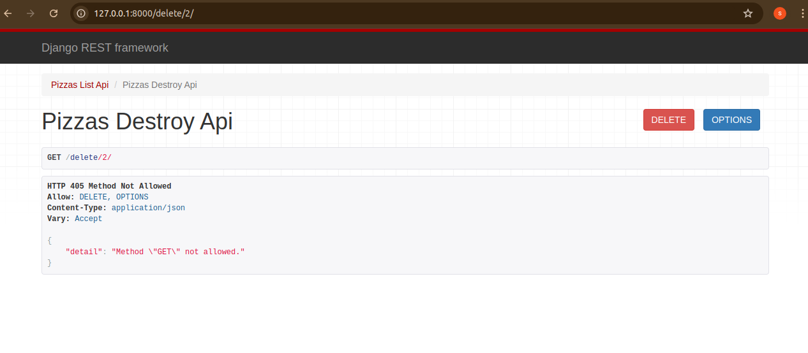

**Title**: `README for Django & React Native Mobile Application`


### Project Overview
This project is a mobile application built with Django serving as the backend and React Native as the frontend. The app is designed to provide a seamless user experience, leveraging the power of Django's robust backend capabilities and React Native's flexibility for building cross-platform mobile apps.

### Features
- **User Authentication**: Secure user registration, login, and authentication.
- **API Endpoints**: RESTful API endpoints created using Django REST Framework (DRF).
- **Data Management**: Efficient data handling and storage with Django models and PostgreSQL.
- **Real-time Notifications**: Push notifications implemented using Django Channels and integrated with the mobile app.
- **Cross-Platform Compatibility**: The app runs smoothly on both Android and iOS, thanks to React Native.
- **Responsive UI**: A user-friendly and responsive interface designed with React Native components.

### Installation and Setup
#### Backend (Django)
1. **Clone the repository**:
    ```bash
    git clone <your-repo-url>
    cd <project-directory>
    ```
2. **Create a virtual environment and activate it**:
    ```bash
    python3 -m venv env
    source env/bin/activate
    ```
3. **Install the required packages**:
    ```bash
    pip install -r requirements.txt
    ```
4. **Apply migrations**:
    ```bash
    python manage.py migrate
    ```
5. **Run the development server**:
    ```bash
    python manage.py runserver
    ```

#### Frontend (React Native)
1. **Navigate to the React Native directory**:
    ```bash
    cd mobile-app
    ```
2. **Install the dependencies**:
    ```bash
    npm install
    ```
3. **Start the React Native development server**:
    ```bash
    npm start
    ```
4. **Run the app on Android/iOS emulator**:
    ```bash
    npm run android  # For Android
    npm run ios      # For iOS
    ```

### API Documentation
The API documentation is generated using `Swagger` and can be accessed at `http://localhost:8000/swagger/`. It includes all available endpoints, request formats, and response structures.

### Deployment
- **Backend**: The Django application can be deployed using services like `Heroku`, `AWS Elastic Beanstalk`, or `DigitalOcean`.
- **Frontend**: The React Native app can be built and published on Google Play Store and Apple App Store.

### Contributing
We welcome contributions! Please feel free to submit a pull request or open an issue if you find any bugs or have suggestions for improvements.

### License
This project is licensed under the MIT License - see the [LICENSE](LICENSE) file for details.

### Acknowledgements
- **Django**: The web framework for perfectionists with deadlines.
- **React Native**: A framework for building native apps using React.


## Screenshots of API endpoints


